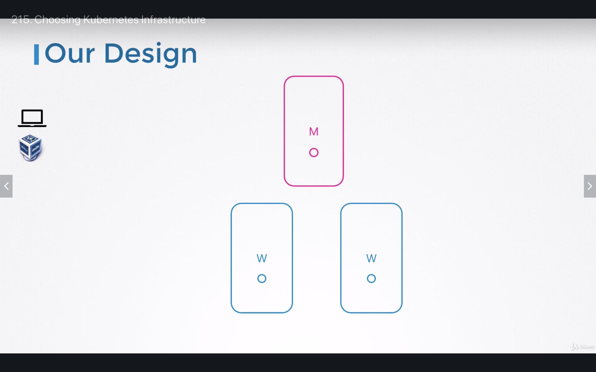
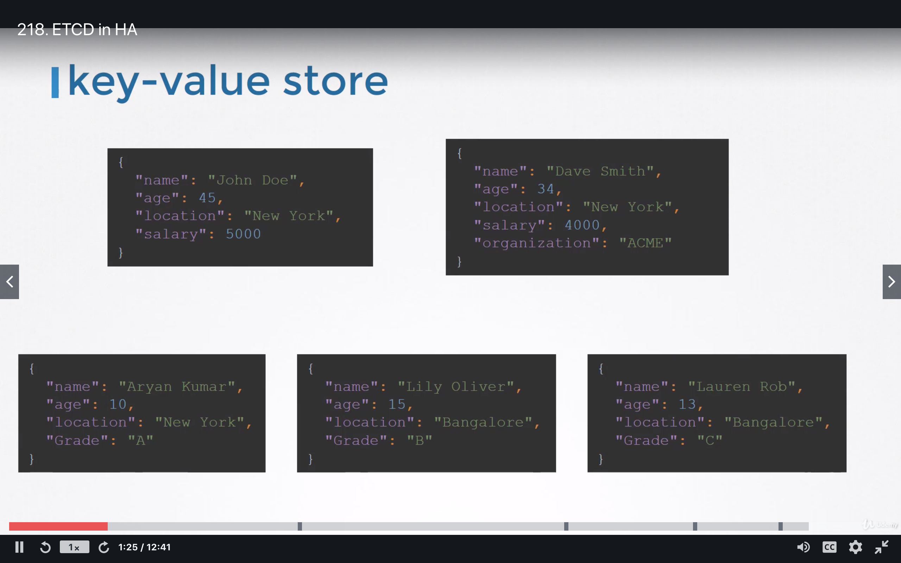

# Reference
https://github.com/mmumshad/kubernetes-the-hard-way
# Ask

# Hosting production application

# Cloud or OnPrem

# Master nodes

# On laptop

## Linux
- Download binary to install
- Or use Minikube
- kubeadm tool to install single or multiple nodes
    - With kubeadm, vms must be provisioned before
    - It allow multi nodes cluster
## Window
- Can't install k8 natively
- Need to utilize virtualization technique to install linux

# Production

## Turnkey solution
- Provision required VMs
- Openshift is popular soln
    - Opensource container management platform built on top of K8
- CloudFoundary Container Runtime
- VMware Cloud PKS
- Vagrant
## Hosted soln
- Google Container engine
- Openshift online
- Azure K8 service
- Amazon hosted k8 service
# Installation on local

# Choose a network soln
https://www.objectif-libre.com/en/blog/2018/07/05/k8s-network-solutions-comparison/
# HA K8 cluster
## Master nodes
- API server runs as active active

- Controller Manager/Scheduler runs as Active/Standby mode

- ETCD as stacked mode

- ETCD as external topology

Final design for local setup

# ETCD in HA

